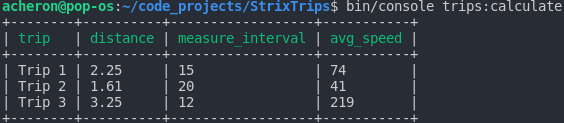

# Trips

## Requirements

+ PHP 7.3 or higher
+ MySQL 5.7 or higher
+ Composer

## Installation

Create `.env` file based on `.env.example` file and set database connection

### Install dependencies

```
composer install
```

### Create database

```
bin/console doctrine:database:create
```

### Make migration

```
bin/console make:migration
```

### Create tables

```
bin/console doctrine:migrations:migrate
```

### Populate database with data fixtures

```
bin/console doctrine:fixtures:load
```

## Functionalities

### Calculate average speed of trips in database

```
bin/console trips:calculate
```

